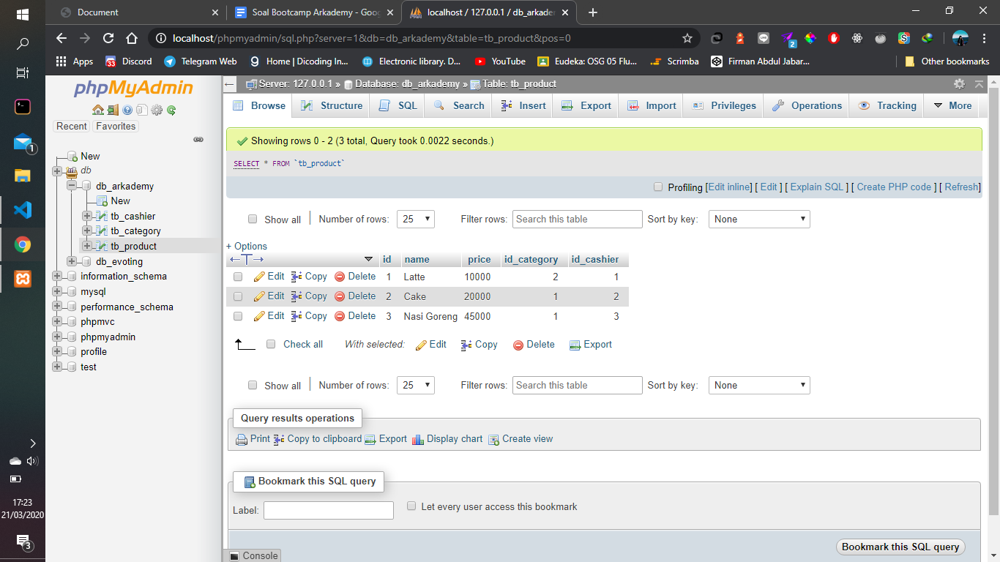
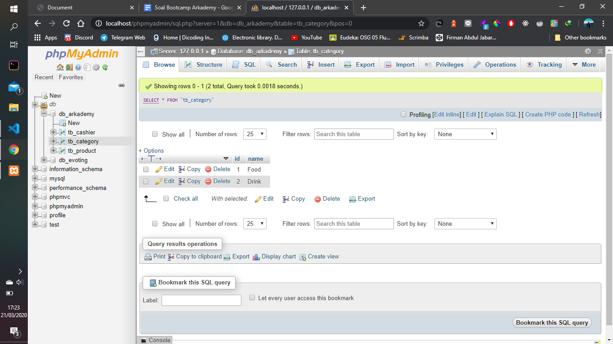
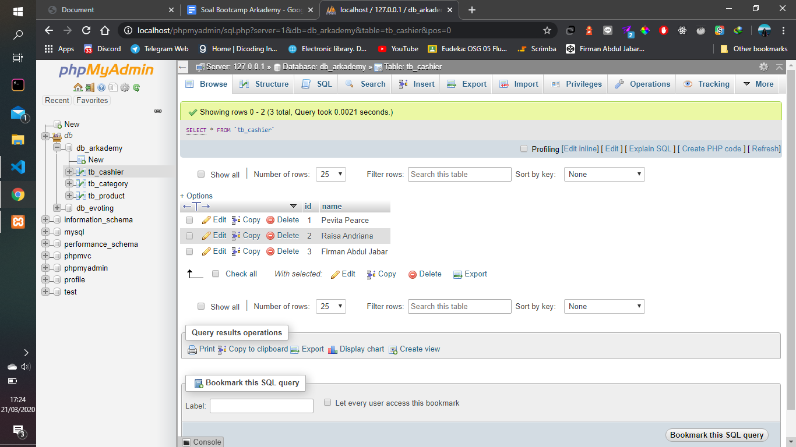
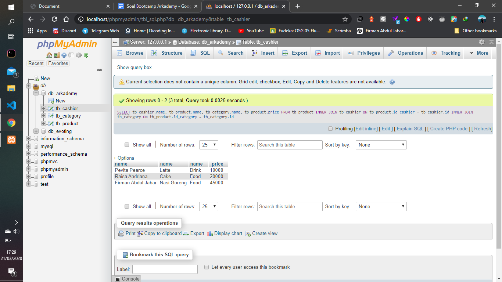
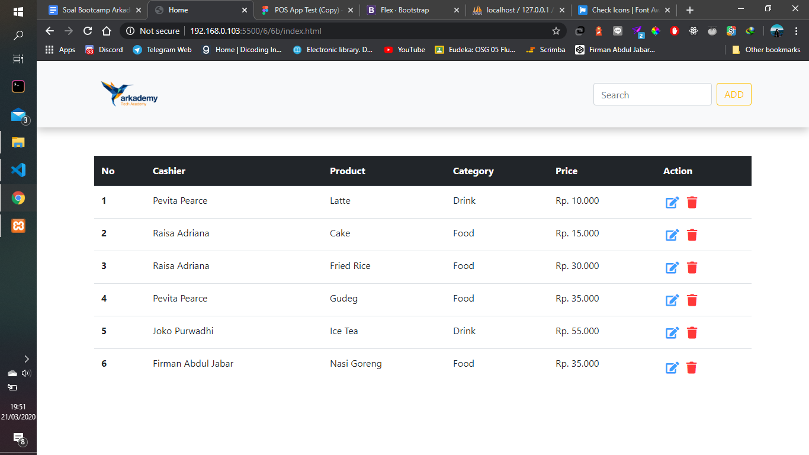
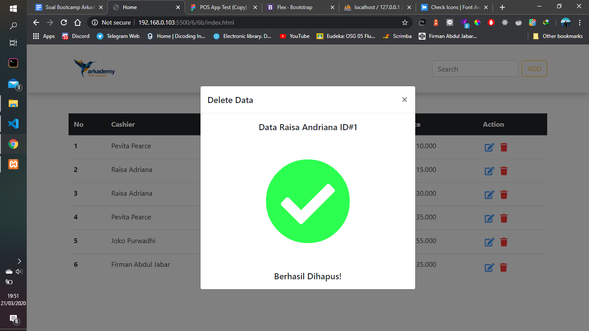
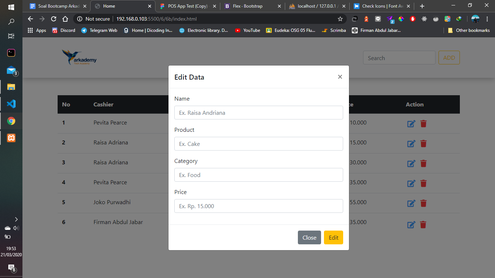
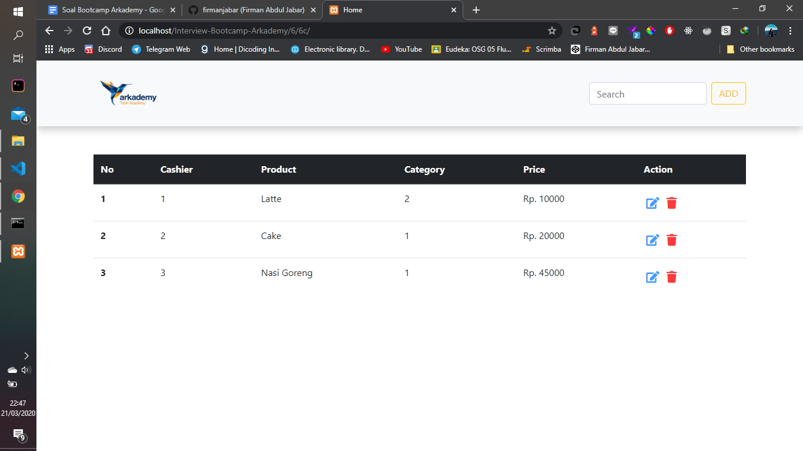

# Interview Arkademy Bootcamp

### Stacks/ Bahasa Pemrograman serta Tools yang Digunakan

- JavaScript
- PHP
- MySQL
- VsCode (Teks Editor/IDE)
- XAMPP

### Screenshot

#### Soal 6-A

#### Soal 6-B

#### Soal 6-C

### Video
